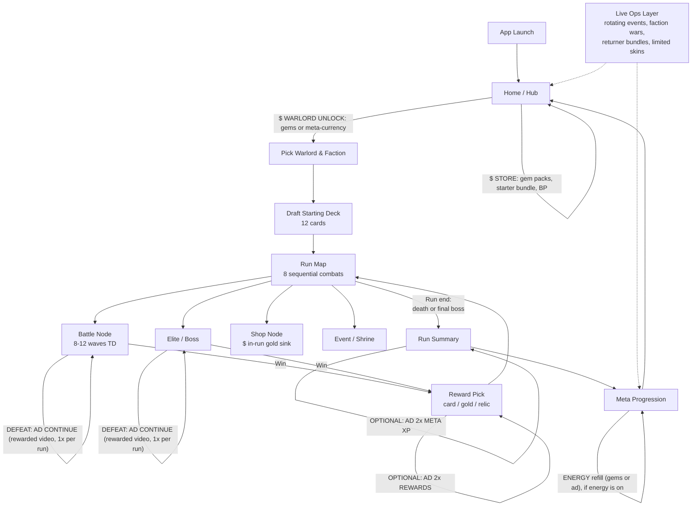

# G8 — Monetisation surface map

_Drafted 2026-04-30 by heartbeat. One diagram, plus a breakdown of every paid touchpoint and where it sits in the player journey. MVP markers show what ships day-one vs post-soft-launch._

## Player-journey diagram (Mermaid)



## Surface-by-surface breakdown

### 1. Gem currency (hard currency)
- **Where:** Home/Hub store tab, plus contextual offers (out-of-energy popup, gacha pull short, BP-tier skip).
- **Price ladder (USD anchor — localise per market):** $0.99 / $4.99 / $9.99 / $19.99 / $49.99 / $99.99. First-purchase doubler on the $4.99 SKU.
- **MVP:** No. Post-soft-launch.

### 2. Starter bundle (one-time, $4.99)
- **Where:** Pops once on Day 2 in the Hub. Single SKU, never repeats.
- **Contains:** 1 paid Warlord (cheapest of the 5), gem stack, **7-day +50% Warlord-XP booster** (per `warlord_tiers_v0.md` §2.3 — multiplier, not flat XP grant; counts toward the ×3.0 stack cap).
- **Why it works:** Anchors the price ladder, converts D2 retained users into payers cheaply, gives flavour-of-paid-content without pay-to-win. The XP booster is the cheapest legitimate "feels like progress" hook — it accelerates *mastery cosmetics*, never raw power.
- **MVP:** No. Add at first commercial pass (post-soft-launch).

### 3. Weekly bundles (rotating)
- **Where:** Store tab, refreshes Mondays. 2–3 SKUs at $1.99 / $4.99 / $9.99.
- **Contents tilt:** cosmetic-heavy + gems. Never raw card power.
- **MVP:** No.

### 4. Warlord unlocks
- **Where:** Pick-Warlord screen + Hub roster. 5 free Warlords from launch, 5 paid (G9).
- **Two paths per paid Warlord:**
  - **Gems** (instant, $4.99-equivalent each).
  - **Meta-currency grind** (Marrow Shards, ~10–15 hours of play). Keeps non-payers progressing.
- **MVP:** Only 3 free Warlords playable. No paid Warlords yet.

### 5. Cosmetic system — Snap-style card treatments + Warlord skins (EXPANDED 2026-05-02)

**Major direction shift: card-treatment economy is now the primary cosmetic surface, not Warlord skins.** Driven by Paul's Marvel Snap reference in `art_direction.md` §2 — Snap's treatment system has demonstrated $40-100M+ ARR purely from cosmetic-frame whales. Each card supports stacked cosmetic treatments with zero gameplay impact.

**Card treatments (per card):**
| Treatment | Effect | Acquisition | Price tier |
|---|---|---|---|
| Default | base frame | free | — |
| Faction frame (×5) | base re-styled per-faction | faction-loyalty milestones | free, 1/faction |
| Foil | static sparkle | gacha + low IAP | $2.99 |
| Gold | metallic gold treatment | mid IAP + season pass | $9.99 |
| Ink | monochrome alt-art | season pass premium | $14.99 |
| Prism | rainbow-shimmer animated | high IAP + BP+ | $19.99 |
| Cursed (ltd) | green-pyre Hanging Hour event | 14-day event | $14.99 ltd |
| Ultimate | combo Gold + Prism + animated | whale SKU | $49.99 |

**Why this works:**
- Pure cosmetic — anti-P2W untouched
- Per-card LTV stacks: a Gold + Prism + Foil treatment on Penance-Captain Vyrrun = $32 of cosmetic spend on ONE card
- Whales who want their entire 30-card deck in Gold ≈ $300 zero-power-impact spend
- Future: 3 alt-art variants × 7 treatments = 21 cosmetic versions per card — infinite content vertical
- Authoring cost: most treatments are shaders, written once, applied to every card automatically

**Warlord skins (now secondary):**
- 1 mastery skin per Warlord earned via Tier 4 unlock (free, see `warlord_tiers_v0.md`)
- Limited paid skins via live-ops, $14.99 — uncommon, scarcity-priced

**Board / card-back / summon-VFX skins:**
- Defer to v1.1. Treatments and Warlord skins are enough cosmetic surface for soft-launch.

**MVP:** No (all cosmetics post-soft-launch). Engine-side: card-treatment shader stack must be designed *into* CardView from B3 onward so retrofitting later is cheap.

### 6. Battle Pass (30-day season, "Marrow Pass")
- **Where:** Permanent BP tab, persistent banner on Hub.
- **Structure:** 50 levels, dual track (free + premium). Premium = $4.99/season. "Pass+" tier at $9.99 grants +10 instant levels and an exclusive skin.
- **Free track:** card unlocks, gold, single cosmetic. **Warlord-XP booster: +10% multiplier active from level 25 onwards** (per `warlord_tiers_v0.md` §2.3) — soft retention nudge for non-payers.
- **Premium track:** gems, paid-Warlord shards, epic/legendary skins, BP-exclusive card frames. **Warlord-XP booster: +25% multiplier for the entire season**, active the moment the premium track is unlocked. This is the booster's primary surface.
- **Booster mechanics (locked, anti-P2W):**
  - Multiplier only — never flat XP. Cannot tier-skip.
  - Counts toward the ×3.0 stack ceiling alongside daily-quest, starter-bundle, event, and skin boosters.
  - Active per-account, applies to whichever Warlord finished the run.
  - Server-side enforcement on the cap (per `warlord_tiers_v0.md` §6).
- **Earn rate tuning target:** finishable in ~25 days at 1 hr/day to leave urgency without rage-gating.
- **MVP:** No. Ship at first commercial pass. (Engine note: BP claim path must call `GameState.set_xp_multiplier_source("battle_pass_premium", 1.25)` so the multiplier registry can re-stack on every claim.)

### 7. Energy (provisional — A/B test on/off)
- **Where:** Run-start gate. 5 charges, 1 charge per run-start, 30-min refill.
- **Refill paths:** gems ($0.99-equivalent), single rewarded-ad refill per day, full refill in starter bundle.
- **Decision:** Default OFF for soft-launch (modern midcore trend). Revisit only if D7 retention is high but ARPDAU is dead.
- **MVP:** No.

### 8. Rewarded video — placement rules
Strict cap: max 5 rewarded-ad views per session, max 8 per day. Frequency-cap helps eCPM.

| # | Trigger | Reward | MVP? |
|---|---------|--------|------|
| 1 | Continue-after-defeat (1x per run) | Resume battle at 25% HP | No |
| 2 | 2× run rewards on run-end summary | Double XP + gold | No |
| 3 | 2× reward on card-pick screen (1x per run) | Pick 2 of 3 instead of 1 of 3 | Possible MVP |
| 4 | Free daily chest (always-on) | Gold + small card-shard pull | **MVP yes** |
| 5 | Bonus gacha pull after a 10x | One free 1x | No |
| 6 | Energy refill (if energy is on) | Full refill, 1x/day | N/A unless energy on |

### 9. Gacha / shard summon
- **Where:** Hub > Summon tab. Pulls give card duplicates → shards → unlock new cards. **No card power locked behind gacha** — every card also obtainable via run rewards. Gacha is a *speed* lever, not a *power* lever.
- **Cost:** 100 gems / pull, 900 gems / 10x. Pity at 80 pulls.
- **MVP:** No.

### 10. In-run shop (soft sink, no real-money)
- **Where:** Shop nodes inside a run, paid in run-gold.
- **Why it matters:** keeps run economy interesting and creates demand pressure that *justifies* meta-currency without forcing IAP. **Pure design lever; no $$$.**
- **MVP:** **Yes.**

### 11. Daily reward calendar + daily quests
- **Where:** Auto-popup on first daily login. 7-day loop, 28-day super-loop, BP XP on every claim.
- **Daily quests (3 slots, refresh 04:00 player-local):**
  1. _"Win a run"_ — generic, awards BP XP + gold.
  2. _"Win a run with Warlord X"_ — rotating Warlord; awards BP XP + **a one-shot ×1.5 Warlord-XP multiplier on the next win with that Warlord** (per `warlord_tiers_v0.md` §2.3). One-shot means it consumes on first qualifying win, not on every win that day. Stacks into the ×3.0 ceiling alongside BP and event boosters.
  3. _"Faction objective"_ — e.g. "Apply 30 Bleed", "Persist 5 units" (M1) — awards BP XP + a small gold/shard payout.
- **Why the one-shot ×1.5 works:** Players who don't own the rotating Warlord ignore it (no FOMO). Players who do get a *visible reason* to pick that Warlord today, which mirrors the daily-engagement loop without locking content. New-player-friendly: the ×1.5 stacks with BP +25% (=×1.875) without hitting the cap, so quest completion always feels like it did something.
- **MVP:** Lite version — single daily chest, no calendar UI, no quest UI yet. (Quest engine plumbing comes alongside BP at first commercial pass.)

### 12. Live-ops bundles (returner / event / faction war)
- **Where:** Push-driven banners on Hub. Limited-time offers gated to player segment (returner = absent 14+ days, whale = top 5% spend, etc.).
- **MVP:** No.

### 13. Warlord-XP booster economy (added 2026-05-11 — W3)

Master registry of every surface that grants a Warlord-XP multiplier. Source of truth for the engine-side multiplier registry. **All boosters multiply only — never grant flat XP, never tier-skip.** Total stack hard-capped at **×3.0** (server-enforced, per `warlord_tiers_v0.md` §6).

| Source | Multiplier | Duration | Stacks toward cap | MVP? | Where in this doc |
|---|---|---|---|---|---|
| Battle Pass — premium track | ×1.25 | season (30 days) | yes | No | §6 |
| Battle Pass — free track, lvl 25+ | ×1.10 | until season end | yes | No | §6 |
| Daily quest — "win with Warlord X" | ×1.50 | one-shot, next qualifying win | yes | No | §11 |
| Starter bundle | ×1.50 | 7 days | yes | No | §2 |
| Live-ops weekend event | ×2.00 | event window, capped 5 boosted wins | yes | No | (live-ops layer §12) |
| Cosmetic skin equipped on Warlord | ×1.05 | as long as equipped | yes | No | §5 |

**Worked stack examples:**
- Free F2P player, no event: ×1.10 (BP free past lvl 25) only → 110 XP/win on a 100-base = ~65 wins to T4 instead of ~72.
- Standard payer mid-season: ×1.25 (BP premium) × ×1.50 (daily-quest one-shot) = ×1.875 effective on that one win.
- Whale on event weekend, skin equipped, daily quest, starter still active: ×1.25 × ×2.00 × ×1.50 × ×1.50 × ×1.05 = ×5.91 raw → **clamped to ×3.0**. Whale ceiling holds at ~25 wins to T4 per the W1 audit.

**Engine handoff (for B4 SDK wiring + W5 tier engine):**
- `GameState` exposes a multiplier registry: `xp_multiplier_sources: Dictionary[StringName, float]`.
- Each source is registered/unregistered by ID (`battle_pass_premium`, `daily_quest_warlord_<id>`, `starter_bundle`, `event_weekend`, `equipped_skin_<warlord_id>`).
- Effective multiplier = `min(3.0, prod(values))`. Computed at run-end, NOT cached — sources may expire mid-run (event windows, daily resets).
- One-shot sources (daily quest) self-unregister on the consumed win; signal `xp_multiplier_consumed(source_id)` for UI.
- BP claim writes `battle_pass_premium → 1.25` once at unlock; never recomputed per-claim.

**Open Qs for Paul:**
1. **Daily quest XP booster — does it stack with the equipped-skin booster?** Currently yes. Could feel mean if the player owns the skin AND completes the quest and the cap eats the skin contribution. Lean: keep it stacking, surface the cap visually (greyed-out source row).
2. **Free-track booster lvl threshold** — set at lvl 25 (50% through the pass). Is that the right band, or push to lvl 30 to give premium more daylight at the early-mid-season conversion window?
3. **Multiplier display string** — `+25% XP` or `×1.25 XP`? (Carries from `warlord_tiers_v0.md` Open Q5; confirming so W4 UI work has one canonical form.)

## Anti-pay-to-win guardrails (design constraint, do not break)

1. Every card and every Warlord is reachable via play, even if slowly. Gems = speed only.
2. No power-creep cards locked to BP or gacha. BP-exclusive content is cosmetic + duplicate cards (shards).
3. No energy in launch build (default off).
4. No PvP — removes the largest pay-to-win pressure entirely (per Paul's design constraint, GDD line 71).
5. Rewarded video never gates progress, only accelerates it.
6. **Warlord XP boosters multiply only — never flat-XP grants, never tier-skip purchases. Total stack capped ×3.0 server-side.** Whale ceiling ~25 wins to T4; free floor ~72 wins. Same destination, different speed. (Per `warlord_tiers_v0.md` §6 + this doc §13.)

## What's in MVP vs later

> **Naming lock (patched 2026-05-22, CANON_PATCHES_APPLIED):** the column previously labelled "MVP (first internal build)" is the **First Commercial Pass (FCP)** slice — post-IMV-1, pre-soft-launch. IMV-1 itself ships only stubbed IAP buttons per `internal_mvp_scope.md`. Soft launch = FCP + battle pass + gacha + starter + cosmetics.

| Surface | First Commercial Pass (FCP) | Soft launch | Post-soft-launch |
|---|---|---|---|
| Run-shop (gold sink) | ✅ | ✅ | — |
| Daily chest (1× rewarded ad) | ✅ | ✅ | — |
| Gold IAP (single SKU) | ✅ | full ladder | — |
| Warlord unlocks (paid) | — | ✅ | — |
| Cosmetic skins | — | ✅ | — |
| Battle Pass | — | ✅ | — |
| Gacha | — | ✅ | — |
| Energy | — | — | A/B test only |
| Live-ops bundles | — | — | ✅ |
| Starter bundle | — | ✅ (Day 2 trigger) | — |
| Warlord XP boosters (BP / quest / event / skin) | — | ✅ (alongside BP+quests) | — |
| **Ascendant Pact subscription** | — | — | ✅ (patch 1.2, post-D14 milestone — see §15) |

## 15. Subscription — The Ascendant Pact (added 2026-05-22, CANON_PATCHES_APPLIED)

Per `HANDOVER.md` §5 and `shop_economy_v0.md` §4.6. The Ascendant Pact is the project's recurring-subscription surface. Locked here as a first-class monetisation surface in the player journey.

| Field | Value |
|---|---|
| Name | The Ascendant Pact |
| Price | £4.99/mo (auto-renew per platform conventions) |
| Daily login bonus | +50 gems/day |
| Daily run-XP multiplier | ×1.25 on first run completed each day |
| BP-tier advancement | +5 free tiers per month |
| Exclusive cosmetic | 1 rotating "Ascendant-only" treatment per month (per faction rotation) |
| Cancellation | per-platform; access continues to end of billing period |
| Pay-to-win check | All multipliers feed into the ×3.0 cap registry per §13. No power-creep — cosmetic-and-velocity only. |
| FOMO check | Cosmetic-only rewards. No card-power or Warlord locked behind it. |
| MVP coverage | **Not in IMV-1. Not in FCP. Not in soft launch.** Ships at patch 1.2 (post-D14 success milestone). Cross-ref `shop_economy_v0.md` §4.6 catalogue spec. |

**Player-journey arrow (Mermaid update — apply when next editing the diagram block):**
```
B -->|"$ ASCENDANT PACT subscription (patch 1.2)"| B
```

**Why subscription is post-soft-launch:** wallet-state plumbing for recurring entitlements (auto-renew, mid-cycle cancellation, grace-period handling) is heavyweight platform work. Wedging it into soft launch risks the launch slot. Better to ship cleaner without it, then add at patch 1.2 once the D14 retention signal confirms a player base worth subscribing.

## Open questions for Paul

1. **Confirm no-energy launch?** (GDD already flags this; restating to lock it.)
2. **Battle Pass price tier** — happy with $4.99 standard / $9.99 Pass+? (Industry-standard, but worth your call.)
3. **Cosmetic-only paid Warlord variants** — would you ever sell a "skinned" Warlord ($14.99) on top of unlocking the base Warlord, or one-and-done?
4. **Geo-priced ladders** — auto-localise via store, or hand-tune top 5 markets? (Auto is fine for soft-launch.)
5. **Ascendant Pact patch-1.2 slot** — confirm post-D14 trigger condition. Alternative: ship Pact with patch 1.1 if D7 conversion exceeds 6% (proves wallet-state plumbing is justified).
